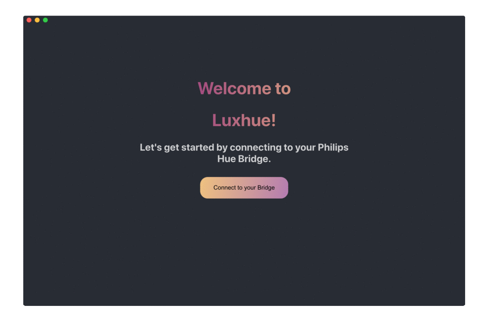

<h1 align="center">
  <br>
  <a href="http://www.luxhue.org"></a>
  <br>
  Luxhue
  <br>
</h1>

<h4 align="center">Luxhue is an easy-to-use desktop application that allows you to control your Philips Hue lights.</h4>
<p align="center">

  
 
 
</p>


<p align="center">
  <a href="#getting-started">Getting Started</a> •
  <a href="#key-features">Key Features</a> •
  <a href="#download">Download</a> •
  <a href="#supported-lights">Supported Lights</a> •
  <a href="#built-with">Built With</a> •
  <a href="#license">License</a>
</p>




## Getting started

1. Fork this repository 
2. Clone your fork by running  
```
git clone https://github.com/<your_username>/luxhue.git
```
3. Run `npm install` to install all the dependencies.
 
 You can now start the app by running `npm start` 

## Key Features

- Changing color of the light
- Adjusting brightness of the light  
- Turning lights on / off
- Automatically connecting to Hue Bridge
- Automatically getting all the lights connected to Hue bridge

You will need to have Philips Hue Bridge device in order to make this application work. This app gets all the data from the API that is running on your local Hue Bridge.

## Download

You can download the app for macOS, Windows and Linux [here](https://www.luxhue.org/download).


## Supported lights

At the moment Luxhue only supports Philips Hue devices with following modelid's. 

### Light bulbs 

LWA001 LCT001 LCT007 LCT010 LCT014 LCT015 LCT016 LWB004 LWB006 LWB007 LWB010 LWB014 LTW001 LTW004 LTW010 LTW015

### Lightstrips

LCL001 LST002 LST001

### Smart plugs

LOM001

If you have other Philips hue devices connected to your Bridge, they will also work but they might show wrong icon. 

More devices will be supported in the future..

## Built with

- [Electron](https://electronjs.org) - Used to wrap the web-app into a cross-platform desktp app.
- [React](https://reactjs.org) - Used to build the UI

## License

Distributed under the MIT License. See `LICENSE` for more information.
