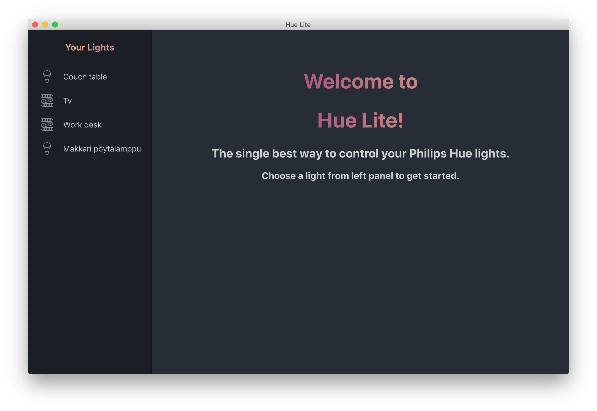
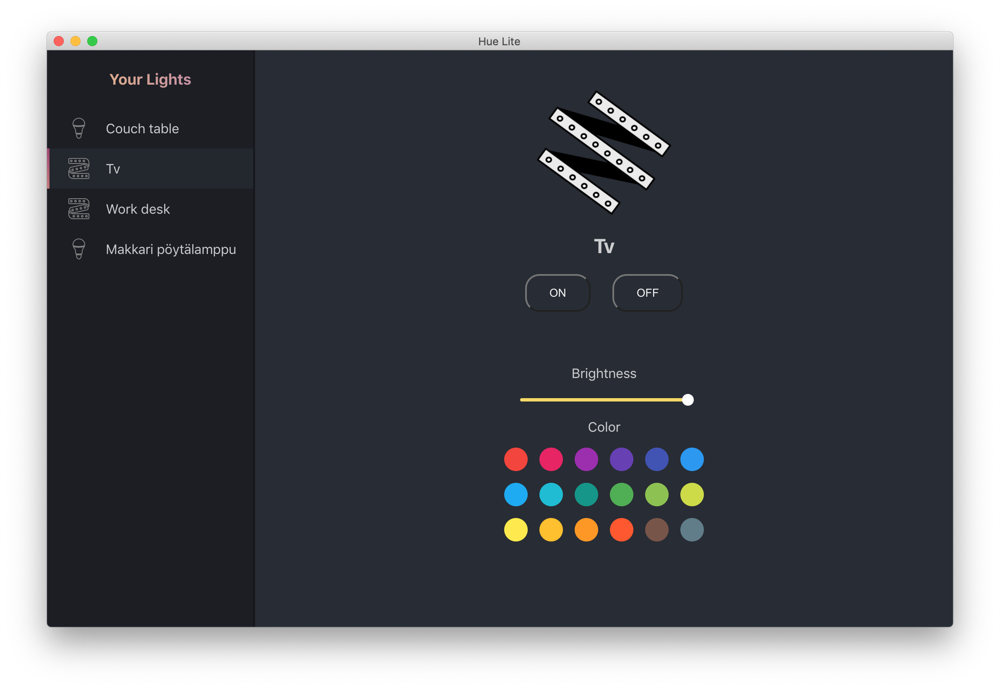

# Hue Lite

Pronounced as ' Hue light'

Version 0.1

Control your Philips hue lights from your computer. 

Supported features includes:  
- Changing color of the light
- Adjusting brightness of the light  
- Turning lights on / off

You will need to have Philips Hue Bridge device in order to make this application work. This app gets all the data from the API that is running on your local Hue Bridge.

## Images

